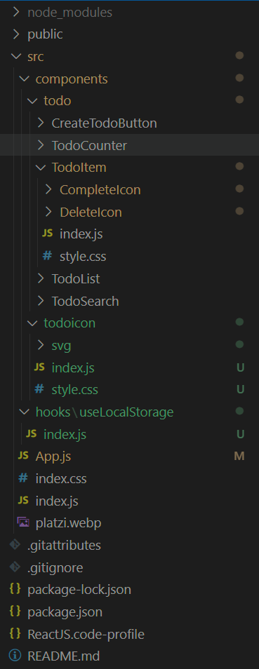

# Local Storage

Permite tener persistencia de datos en el lado del cliente, aun cuando se cierre el navegador. LocalStorage solo guarda strings, entonces hay que hacer parseo para poder leer y escribir.

## Consultar datos

```js
localStorage.getItem("key");
```

### Json

```js
let json = JSON.parse(localStorage.getItem("key"));
```

## Escribir datos

```js
localStorage.setItem("key", datos);
```

### Json

```js
let _string = JSON.stringify(_json)
localStorage.setItem("key", _string));
```

## Remover datos

```js
localStorage.removeItem("key");
```

# Custom Hooks

Es una forma de abstraer seccion de codigo en una estructura custom o como los estados de react, para generar un objeto con funcionalidades abstraidas al resto del sistema.

```js
// importamos lo que queramos
import { UpperCaseFirstWord, AddColor } from ".......";

// creamos una funcion que normalmente inicia con 'use.....'
export function useNombre(initNombre) {
  // creamos un estado para guardar informacion temporal
  [nombre, setNombre] = React.useState(initNombre);

  // funcion interna
  function ParseNombre(nombre) {
    return UpperCaseFirstWord(nombre);
  }

  // funcion de actualizacion que daremos
  function ActualizarNombre(nuevoNombre) {
    setNombre(ParseNombre(nuevoNombre));
  }

  // funcion de mostrar nombre editado
  function ColorNombre(color) {
    return AddColor(nombre);
  }

  // retornar el hook, como State pero con más cosas
  return [nombre, ActualizarNombre, ColorNombre];
}
```

```js
// importamos el hook
import { useNombre } from ".....";

// invocamos el hook
const [nombre, setNombre, nombreColor] = useNombre("arturito");

// usamos el hook
console.log(nombre);
console.log(nombreColor("green"));
setNombre("citrico");
```

# Ordenar con carpetas

Un estilo de orden de carpetas, puede ser por funcionalidad. Donde se crea una carpeta con el nombre de la funcionalidad, y dentro de esta tiene un archivo `index.js` que sera el javascript por defecto.

```files
src
- App.js
- BotonCrear
-- index.js
-- style.css
-- html.html
```



# React Effect

Son un Hook que permite correr codigo asincronico en ciertos casos. Se puede llegar a ejecutar en bucle infinito si no se le entrega un segundo parametro array. Con el array vacio se ejecuta la primera vez y con el array con elementos se ejecuta la primera vez y cuando ocurra un cambio en determinados estados.

Se ejecuta con:

```js
React.useEffect(funcion, array_estados);

React.useEffect(() => {
  console.log("Cambio las monedas");
}, [dolares, rublos]);
```

Parece que funciona sin usar asincronismo.

# React Context

Permite crear un espacio de informacion compartida para la aplicacion. Asi no hay que entregar a travez de props los datos, modificadores de estado, funciones, callbacks u otros.

### Crear el contexto

```js
import React from "react";

// creamos un nuevo contexto
const pilasContext = React.createContext();

// creamos una funcion para proveer, esta recibe a los hijos del html
// esta solo lo usaremos una vez antes de donde usaremos el contexto
function PilasProvider({children}) {
  const variables = {
    pilas = 10,
    addPila = (() => pilas++),
  }

  return <PilasContext.Provider values={variables}>{children}</PilasContext.Provider>;
}

// no se que hace aqui, puede que no sea necesario, aun
<PilasContext.Consumer></PilasContext.Consumer>;

// exportamos el provider
export { PilasContext, PilasProvider };
```

### Colocar el provider en el lugar correcto

Esto puede ser al inicio de la aplicacion o en una posicion posterior, pero debe estar ante sus PilasContext.Consumer.

```js
import {PilasProvider} from './PilasContext'

function App(){
  return <PilasProvider><AppUI/><PilasProvider/>
}
```

### Colocar los consumer

Estos se colocan donde se quiera consumir el contexto.

```js
import { PilasContext } from "./PilasContext";

function AppUI() {
  return;
  <>
    <Title />
    <Subtitle />
    // usamos el contexto
    <PilasContext.Consumer>
      // creamos una funcion para consumir con las variables
      {({ pilas, addPila }) => (
        // usamos las variables del contexto
        <>
          <CantidadPilas pilas={pilas} />
          <BotonAddPila func={addPila} />
        </>
      )}
    </PilasContext.Consumer>
  </>;
}
```

# Hook useContext

En lugar de usar el Context.Consumer, se puede usar:

```js
// llamamos las variables del contexto
const { pilas, addPila } = React.useContext(PilasContext);

function AppUI() {
  return;
  <>
    <Title />
    <Subtitle />
    // usamos las variables del contexto
    <CantidadPilas pilas={pilas} />
    <BotonAddPila func={addPila} />
  </>;
}
```

Pero es requerido si o si el Context.Provider al comienzo.

# React Portals

Permite teletransportar componentes de react entre nodos de html. Esto puede ser util para pantallas emergentes o desplazamiento a diferentes partes de la pagina los componentes. El componente puede estar de forma simultanea en diferentes partes?

Para que funcione es necesario envolverlo en un componente modal.

Se tendra que indicar el nodo al que enviar la teletransportacion. Parece ser que al invocar el nodo desde cualquier parte del codigo, el componente se almacenara en un elemento que indiquemos con su id, y no tanto como que se agrega directo al html. En el html principal, debajo del root podemos agregar la direccion donde se anidara el modal.

```html
<body>
  <div id="root"></div>
  <div id="modal"></div>
</body>
```

Hay que crear el portal, para esto crearemos un componente que llamaremos modal que sera el que se invoke.

```js
import React from "react";
import ReactDOM from "react-dom";

// modal es generico, este usa los portales
function Modal({ children }) {
  // retornar un portal que contenido y a donde
  return ReactDOM.createPortal(
    <div className="Modal">{children}</div>,
    document.getElementById("modal")
  );
}

export { Modal };
```

Para llamar al portal se tiene que colocar el portal en el UI y este puede ser activado a travez de una condicional externa a el.

```js
<CreateTodoButton
  action={() => {
    setOpenModal(!openModal);
  }}
  closeMode={openModal}
/>;

{
  openModal && (
    <Modal>
      <div></div>
    </Modal>
  );
}
```
